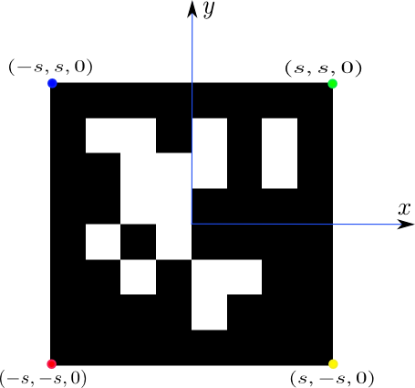

# marker BA 公式推导
## 李代数求导基础
有四种方式进行李代数的求导： gtsam作者笔记里的推导方式，strasdat博士论文里的推导方式，TUM kerl硕士论文里的推导方式，最后就是barfoot的state esitamtion for robotics一书中的推导了。最直观简介的是gtsam和kerl的推导，最完备最可扩展的推导是barfoot的方式，也就是高翔书上的推导。

目的：空间中一点$P_w$,通过$T_{cw}$转换到相机坐标系下$P_c$,高斯牛顿的时候需要不断调整优化$T_{cw}$.

这时就有了两个思路：
1. 	假设$T_{c'c}＝exp(\hat{\delta\xi})$是微小增量, $T_{c'w}=exp(\hat{\delta\xi})T_{cw}=exp(\hat{\delta\xi})exp({\hat\xi})$。注意小增量是直接放在李代数的。在推导前，先熟悉一个性质,下面公式中粗体$\mathbf{P}$是$P$的齐次坐标形式。
$$\hat\xi \mathbf{P}=\begin{bmatrix} \hat{\mathbf{\omega}}& \mathbf{v}\\ \mathbf{0} & \mathbf{0}\end{bmatrix}\begin{bmatrix}P \\ 1 \end{bmatrix}＝\begin{bmatrix} \mathbf{\omega}\times P+\mathbf{v}\\ \mathbf{0}\end{bmatrix}=\begin{bmatrix} -\hat P&&\mathbf{I}_3 \\ \mathbf{0} && \mathbf{0}\end{bmatrix}\begin{bmatrix}\mathbf{\omega}\\\mathbf{v}\end{bmatrix}$$
有了这个性质，可以开始推导了，推导过程省略齐次坐标最后一行
$$\begin{split}
\frac{\partial(P_{c'})}{\partial(\delta\xi)} = & \frac{\partial(exp(\hat{\delta\xi})T_{cw}P_w)}{\partial(\delta\xi)}
\\\approx & \frac{\partial((I+\hat{\delta\xi})P_c)}{\partial(\delta\xi)} = \frac{\partial(\hat{\delta\xi}P_c)}{\partial(\delta\xi)}=[[-P_c]_{\times},\mathbf{I}_{3}]_{3\times6}
\\=& \begin{pmatrix} 0 & z & -y & 1 & 0 &0 \\ -z & 0 & x & 0 & 1 & 0 \\ y & -x & 0 & 0 & 0 & 1 \end{pmatrix}_{3\times 6}
\end{split}
$$
这里**$[*]_{\times}$和$\hat{(*)}$都是表示把向量转换成反对称矩阵**,采用两种形式纯粹是为了书写清楚，有的时候式子太长了，用hat括不下。
2. 	另一个思路是$T_{c'w}=exp([\delta\xi+\xi]_{\times})$。这里是直接在李代数上叠加一个微小变量。
$$\frac{\partial(exp(\hat\xi)P_w)}{\partial(\delta\xi)}=\lim_{\delta\xi\rightarrow0}\frac{exp([\delta\xi+\xi]_{\times})P_w-exp(\hat\xi)P_w}{\delta\xi}$$
注意分子上面减去的那一部分和$\delta\xi$没关系，可以直接忽视，问题是
$$ exp([\delta\xi+\xi]_{\times})= exp([\delta\xi]_{\times}+[\xi]_{\times})\neq exp([\delta\xi]_{\times})exp([\xi]_{\times})$$
这是因为矩阵的幂指数可不能随便展开，需要引入专门解决这个问题的**BCH公式**:
$$ln(exp(\hat{\xi_1})exp(\hat\xi_2))\approx \{ \begin{matrix} \mathbf{J_\ell}(\xi_2)^{-1}\xi_1 + \xi_2 & if\quad \xi_1 \quad is \quad small \\ \xi_1 + \mathbf{J_r}(\xi_1)^{-1}\xi_2 & if\quad \xi_2 \quad is \quad small \end{matrix}$$具体参见barfoot书公式(7.80)。上面等式中，不妨假设$\xi_1=\delta\xi$,则有:
$$exp(\hat{\delta\xi})exp(\hat\xi)=exp([\xi+\mathbf{J_\ell(\xi)^{-1}\delta\xi}]_{\times})$$或者
$$exp([\delta\xi+\xi]_{\times})=exp([\mathbf{J_\ell(\xi)\delta\xi}]_{\times})exp(\hat\xi)$$
回到求导的公式：
$$\begin{split}
\lim_{\delta\xi\rightarrow0}\frac{exp([\delta\xi+\xi]_{\times})P_w-exp(\hat\xi)P_w}{\delta\xi}=& \lim_{\delta\xi\rightarrow0}\frac{exp([\mathbf{J_\ell}(\xi)\delta\xi]_{\times})exp(\hat\xi)P_w}{\delta\xi}
\\= & \lim_{\delta\xi\rightarrow0}\frac{(\mathbf{I}+[\mathbf{J_\ell}(\xi)\delta\xi]_{\times})exp(\hat\xi)P_w}{\delta\xi}
\\= & \lim_{\delta\xi\rightarrow0}\frac{[\mathbf{J_\ell}(\xi)\delta\xi]_{\times}P_c}{\delta\xi}=[[-P_c]_{\times},\mathbf{I}_{3}]_{3\times6}\mathbf{J_\ell}
\end{split}
$$

上述两种方式都没问题，相差一个$\mathbf{J_\ell}$,但是思路１更简单明了，也是gtsam作者采用的推导方式。

## Bundle Adjustment中的雅克比
和上节一样，相机位姿为$T_{cw}$,世界坐标系一点$P_w$，投影方程为
$$p=\binom{u}{v}=\pi(P_c)=\binom{\frac{xf_x}{z}+c_x}{\frac{yf_y}{z}+c_y}$$容易得到
$$\frac{\partial p}{\partial P_c}=\begin{pmatrix} \frac{\partial u}{\partial x} & \frac{\partial u}{\partial y} & \frac{\partial u}{\partial z}\\ \frac{\partial v}{\partial x} & \frac{\partial v}{\partial y} & \frac{\partial v}{\partial z} \end{pmatrix}_{2\times 3}=\begin{pmatrix} \frac{f_x}{ z} & 0 & \frac{-xf_x}{z^2}\\ 0 & \frac{f_y}{z} & \frac{-yf_y}{z^2} \end{pmatrix}_{2\times 3}$$
其中$\color{red}{P_c=(x,y,z)^T}$.

### 图像坐标误差对相机位姿增量求导
世界坐标系中３d点到像素坐标的转换为：
$$p=\binom{u}{v}=\pi(T_{cw}P_w)$$联立上文的两个偏导得
$$\begin{split}
\frac{\partial p}{\partial(\delta\xi)}=&\frac{\partial p}{\partial P_c}\cdot\frac{\partial P_c}{\partial(\delta\xi)} 
\\ =& \begin{pmatrix} -\frac{xy}{ z^2}f_x & (1+\frac{x^2}{z^2})f_x & -\frac{y}{z}f_x & \frac{1}{z}f_x & 0 & -\frac{x}{z^2}f_x\\ -(1+\frac{y^2}{z^2})f_y & \frac{xy}{z^2}f_y & \frac{x}{z}f_y & 0 & \frac{1}{z}f_y & -\frac{y}{z^2}f_y\end{pmatrix}_{2\times 6}
\end{split}\qquad(1)$$
### 图像坐标误差对坐标$P_w$求导
$$P_c =\begin{pmatrix} x\\y \\z \end{pmatrix}= T_{cw}P_w = \begin{pmatrix} x_wr_1+y_wr_2+z_wr_3+t_1 \\x_wr_4+y_wr_5+z_wr_6+t_2\\x_wr_7+y_wr_8+z_wr_9+t_3\end{pmatrix}$$
$$\frac{\partial P_c}{\partial P_w} = \begin{pmatrix} r_1 & r_2 & r_3  \\r_4 & r_5 & r_6\\ r_7 & r_8 & r_9\end{pmatrix}=\mathbf{R}$$
$$\begin{split}
\frac{\partial p}{\partial(P_w)}=&\frac{\partial p}{\partial P_c}\cdot\frac{\partial P_c}{\partial(P_w)} 
\\ =& \begin{pmatrix} \frac{f_x}{ z} & 0 & \frac{-xf_x}{z^2}\\ 0 & \frac{f_y}{z} & \frac{-yf_y}{z^2} \end{pmatrix}_{2\times 3}\cdot\mathbf{R}
\end{split}$$

注意，上面的导数有的程序里面在前面都多了一个负号，这是由误差向量的定义是$e= p - p_{img}$还是$e= p_{img} - p$造成的,其中$p_{img}$是检测到的图像坐标，$p$是理论计算得到的坐标，上面我们采用的误差向量是$e= p - p_{img}$，orbslam中采用的是$e= p_{img} - p$。
## marker bundle adjustment中的雅克比
marker作为一个平面，四个角点之间有空间位置的约束，因此不能简单把marker的ba问题当成四个点的ba问题。在这里，ba的时候，我们采用优化调整marker坐标系姿态来调整marker各角点的空间位置，优化变量从角点的位置变成了marker坐标系的６个变量。

marker以marker中心为原点，垂直于纸面向上为z,正对marker水平向右为x轴。marker坐标系到世界坐标系的转换$T_{mw}$。
marker边长为$size=2s$，四个角点$P_{m}^{i}$在marker坐标系中的表示如下图所示。

已知图像某个角点坐标为$p_{img}=(u,v)^T$,为了和orbslam代码统一，这里我们采用$e= p_{img} - p$。
$$p=\pi(T_{cw}T^{-1}_{mw}P_m)$$
所以偏导数是两部分，一个是对相机的$T_{cw}$，一个是对marker的$T_{mw}$
### 角点图像坐标误差对相机位姿增量求导
和之前单点ba中的雅克比推导一样，这里可以直接将角点坐标$P_m^{i}$转换到相机坐标系下，$\mathbf{P}_c^i＝T_{cm}\mathbf{P}_m^i$，雅克比的计算只需要把坐标$P_c^i$代入公式１即可，同时由于误差向量多了个负号，所以公式１前面要加一个负号。
### 角点图像坐标对marker位姿增量的求导
先把求雅克比时最难部分的表达式写出来：
$\mathbf{P}_c=T_{cw}T^{-1}_{mw}\mathbf{P}_m$
$$\delta\xi=\xi_{m'm}\rightarrow \xi_{m'w}=\xi_{mw}+\delta\xi$$
有了表达式就可以依葫芦画瓢，跟思路１一样，推导过程如下：不过前面推导的时候，我们省略了齐次坐标的最后一行，这里我们先不省略。
$$\begin{split}
\lim_{\delta\xi\rightarrow0}\frac{\partial \mathbf{P_c}}{\partial(\delta\xi)}
=& \lim_{\delta\xi\rightarrow0}\frac{exp(\hat{\xi}_{cw})[exp(\hat{\delta\xi})exp(\hat{\xi}_{mw})]^{-1}\mathbf{P_m}-exp(\hat{\xi}_{cw})[exp(\hat{\xi}_{mw})]^{-1}\mathbf{P_m}}{\delta\xi}
\\ =& \lim_{\delta\xi\rightarrow0}\frac{exp(\hat{\xi}_{cw})exp(\hat{\xi}_{mw})^{-1}exp(\hat{\delta\xi})^{-1}\mathbf{P_m}}{\delta\xi}
\\ =& \lim_{\delta\xi\rightarrow0}\frac{T_{cw}T_{wm}exp(-\hat{\delta\xi})\mathbf{P_m}}{\delta\xi}
\\ =& \lim_{\delta\xi\rightarrow0}\frac{T_{cm}(I-\hat{\delta\xi})\mathbf{P_m}}{\delta\xi}
\\ =& \lim_{\delta\xi\rightarrow0}\frac{T_{cm}(-\hat{\delta\xi})\mathbf{P_m}}{\delta\xi}
\\ =& {T_{cm}*\begin{bmatrix} [P_m]_{\times}&& -\mathbf{I}_{3}\\ \mathbf{0}&& \mathbf{0}\end{bmatrix}}
\\=&  \begin{bmatrix} \mathbf{R}_{cm} && \mathbf{t}_{cm}\\ \mathbf{0}&& 1\end{bmatrix}\begin{bmatrix} [P_m]_{\times}&& -\mathbf{I}_{3}\\ \mathbf{0}&& \mathbf{0}\end{bmatrix}
\end{split}$$
去掉最后一行对应的齐次坐标，可以得到没有其次坐标时的偏导数如下：
$$\frac{\partial P_c}{\partial(\delta\xi)} = \mathbf{R}_{cm}\begin{bmatrix} [P_m]_{\times}&& -\mathbf{I}_{3}\end{bmatrix}$$
到这一步就知道为啥不省略齐次坐标最后一行了
$$\begin{split}
\frac{\partial p}{\partial(\delta\xi)}=&\frac{\partial p}{\partial P_c}\cdot\frac{\partial P_c}{\partial(\delta\xi)} 
\\ =& \begin{pmatrix} \frac{f_x}{ z} & 0 & \frac{-xf_x}{z^2}\\ 0 & \frac{f_y}{z} & \frac{-yf_y}{z^2} \end{pmatrix}_{2\times 3}\cdot\mathbf{R}_{cm}\cdot\begin{pmatrix} 0 & -z_m & y_m & -1 & 0 &0 \\ z_m & 0 & -x_m & 0 & -1 & 0 \\ -y_m & x_m & 0 & 0 & 0 & -1 \end{pmatrix}_{3\times 6}
\end{split}\qquad(2)$$
注意，写到程序里的时候，上面公式(2)也要再取个负号，因为误差向量为$e=p_{img}-p$ 

